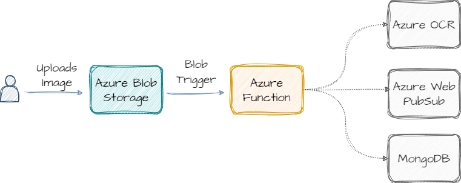

# Image Text Extractor Application

The Image Text Extractor Application is designed to extract text from images. Leveraging advanced technologies from the Azure ecosystem, this app instantly retrieve the text content present within uploaded images. The app employs Optical Character Recognition (OCR) through Azure Cognitive Services to ensure accurate and efficient text extraction.

## Architecture

## Tech Stack

- **_Azure Blob Storage_** -> For Storing the uploaded images
- **_Azure Cognitive Services_** -> For Extraction of Text from the Image
- **_Azure Functions App_** -> Serverless Functions to handles Extraction of Text from Image and providing connection strings.
- **_Azure Web Pub/Sub Service_** -> For real-time updates to UI
- **_MongoDB_** -> For Storing extraction results
- **_ReactJS with Chakra UI_** -> For developing Frontend Components and UI of the application.

## Features

- Upload images to Azure Blob Storage
- Extract text from images using Azure Cognitive Services
- Stores extracted text data in MongoDB
- Real-time updates with Azure Web Pub/Sub Service
- User-friendly interface with ReactJS and Chakra UI

## Getting Started

### Prerequisites

- Azure account
- MongoDB account
- Node.js and npm installed on your machine

### Installation

1. Clone the repository with `git clone https://github.com/DevShobhit/textextraction.git`
2. Install dependencies with `npm install`
   - For Frontend in project directory
   - For Backend in functions directory
3. Set up your Azure and MongoDB services
4. Update the `.env` file with your service credentials
5. Run the application with `npm start`

## Usage

- Access the app through your browser with either your Local development server URL or deployed URL present in description of the Repository.
- Provide required Information and Upload an image containing text.
- Wait for the text extraction process to complete.
- View the extracted text.

## Contributing

Contributions are welcome! To contribute to the Image Text Extractor App, follow these steps:

- Fork the repository.
- Create a new branch: `git checkout -b feature/your-feature-name`
- Make your changes and commit them: `git commit -m "Add your message"`
- Push to the branch: `git push origin feature/your-feature-name`
- Create a pull request outlining your changes.
